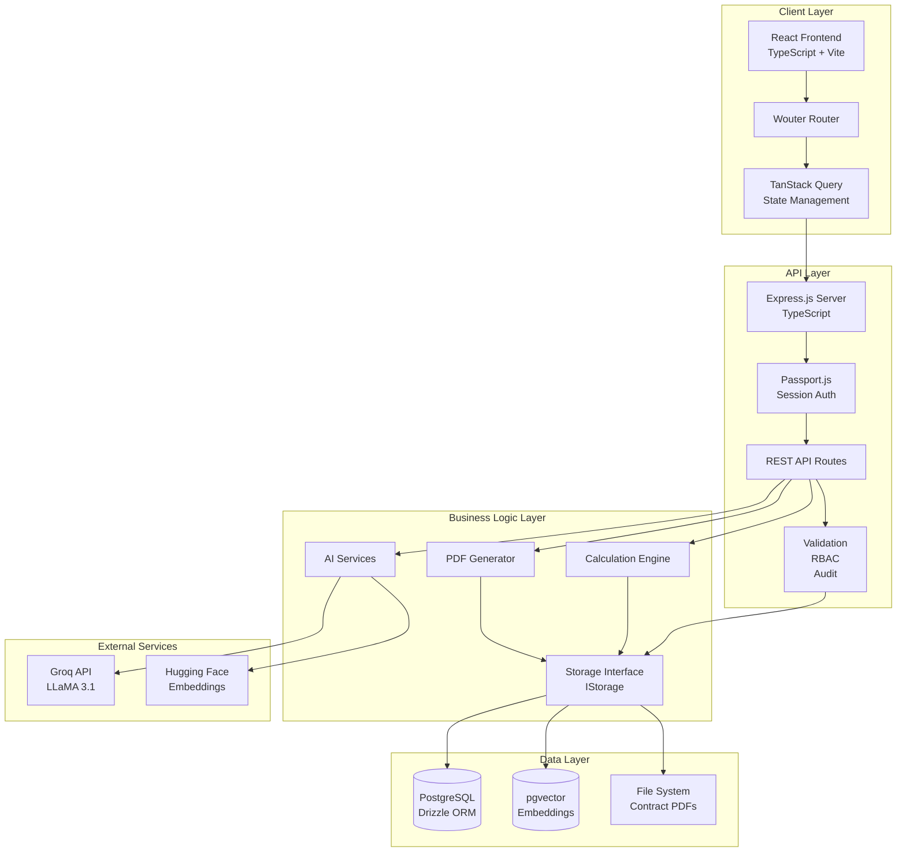
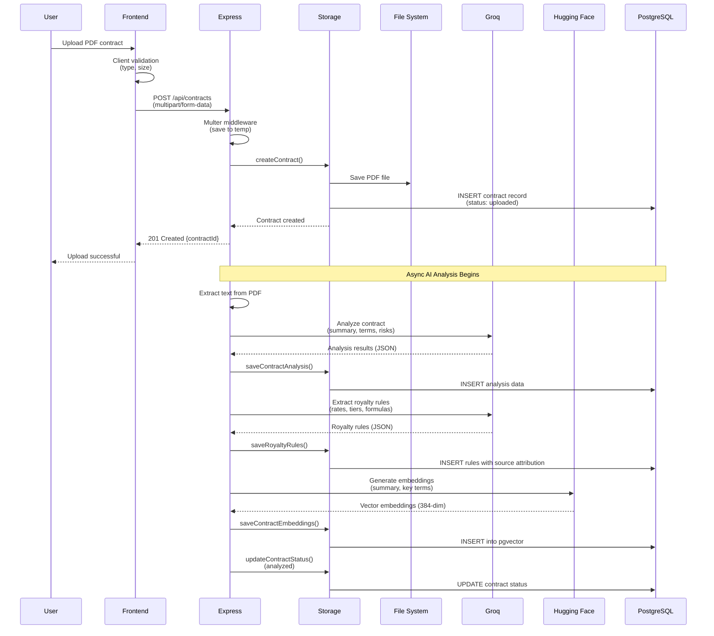
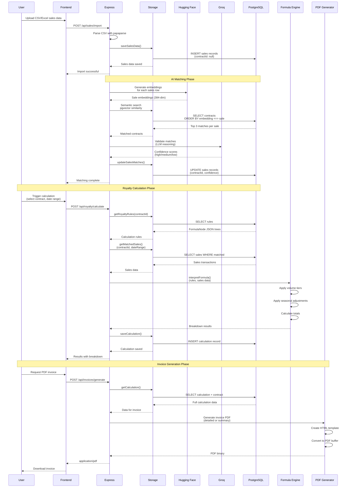
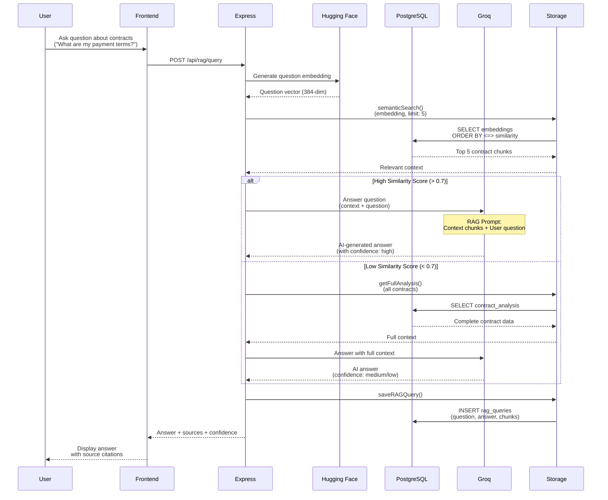
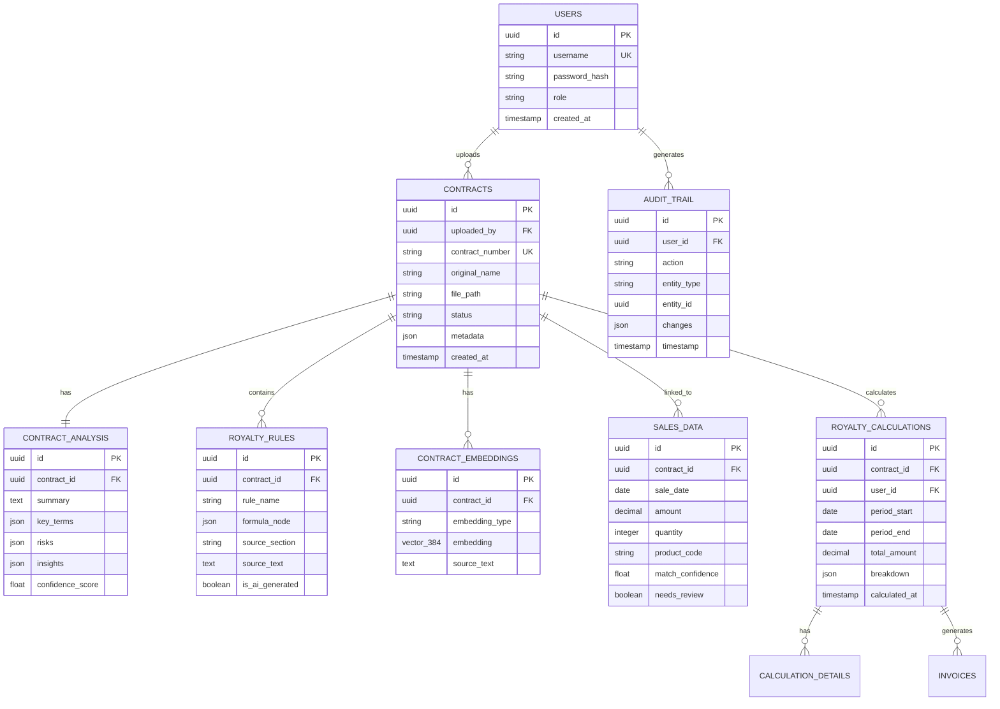
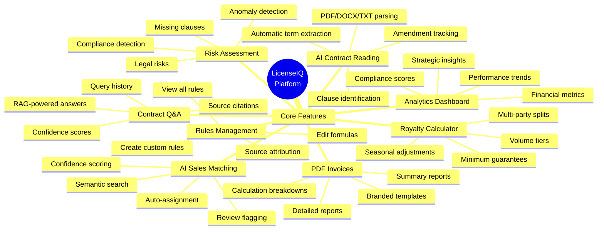
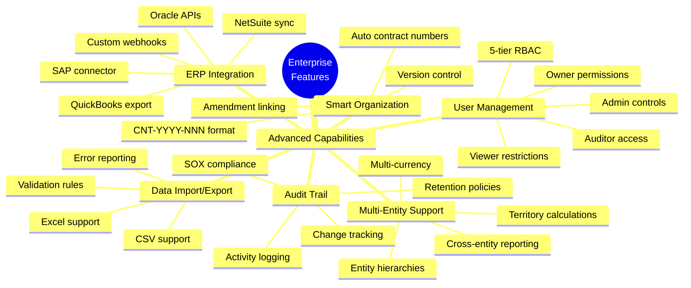

# LicenseIQ Platform Architecture

**Version:** 1.0  
**Last Updated:** October 22, 2025

---

## Table of Contents
1. [System Overview](#system-overview)
2. [Technology Stack](#technology-stack)
3. [High-Level Architecture](#high-level-architecture)
4. [Data Flow Diagrams](#data-flow-diagrams)
5. [Database Schema](#database-schema)
6. [AI Integration Architecture](#ai-integration-architecture)
7. [Feature Map](#feature-map)

---

## System Overview

LicenseIQ is an AI-powered SaaS platform for intelligent contract management and royalty calculation. Built for manufacturing companies managing $50M+ revenue with complex licensing agreements.

### Key Metrics
- **95% time reduction** in royalty calculations (10-40 hours → 30 minutes)
- **$200K+ annual savings** in labor and dispute resolution
- **4-week implementation** vs 18-month enterprise solutions
- **100% audit compliance** with SOX-compliant activity logging

---

## Technology Stack

### Frontend Layer
```
┌─────────────────────────────────────────────────────────────┐
│                     FRONTEND STACK                          │
├─────────────────────────────────────────────────────────────┤
│                                                             │
│  React 18              → UI Framework                       │
│  TypeScript            → Type Safety                        │
│  Vite                  → Build Tool & Dev Server            │
│  Wouter                → Client-Side Routing                │
│  TanStack Query v5     → Server State Management            │
│  React Hook Form       → Form Management                    │
│  Zod                   → Schema Validation                  │
│                                                             │
│  TailwindCSS           → Utility-First Styling              │
│  shadcn/ui             → Component Library                  │
│  Radix UI              → Accessible Primitives              │
│  Lucide React          → Icon Library                       │
│  Recharts              → Data Visualization                 │
│                                                             │
│  Framer Motion         → Animations                         │
│  date-fns              → Date Utilities                     │
└─────────────────────────────────────────────────────────────┘
```

**Why These Choices:**
- **React + TypeScript**: Type-safe component development with excellent ecosystem
- **Vite**: Lightning-fast HMR and optimized production builds
- **TanStack Query**: Automatic caching, background refetching, and optimistic updates
- **shadcn/ui**: Unstyled, accessible components with full customization control
- **Zod**: Runtime validation with TypeScript inference for end-to-end type safety

### Backend Layer
```
┌─────────────────────────────────────────────────────────────┐
│                     BACKEND STACK                           │
├─────────────────────────────────────────────────────────────┤
│                                                             │
│  Node.js 20            → JavaScript Runtime                 │
│  Express.js            → Web Framework                      │
│  TypeScript            → Type Safety                        │
│  tsx                   → TypeScript Execution               │
│                                                             │
│  Passport.js           → Authentication Middleware          │
│  express-session       → Session Management                 │
│  connect-pg-simple     → PostgreSQL Session Store           │
│                                                             │
│  Multer                → File Upload Handling               │
│  pdf-parse             → PDF Text Extraction                │
│  pdfkit                → PDF Generation                     │
│  html-pdf-node         → HTML to PDF Conversion             │
│                                                             │
│  papaparse             → CSV Parsing                        │
│  xlsx                  → Excel File Processing              │
│  nanoid                → Unique ID Generation               │
│  date-fns              → Date Utilities                     │
└─────────────────────────────────────────────────────────────┘
```

**Why These Choices:**
- **Express.js**: Mature, flexible web framework with extensive middleware ecosystem
- **Passport.js**: Industry-standard authentication with multiple strategy support
- **Session-based auth**: Secure, server-side state management vs stateless JWT
- **Multer**: Robust file upload handling with validation and storage control

### Database Layer
```
┌─────────────────────────────────────────────────────────────┐
│                    DATABASE STACK                           │
├─────────────────────────────────────────────────────────────┤
│                                                             │
│  PostgreSQL 15+        → Relational Database                │
│  Neon Database         → Serverless Hosting                 │
│  Drizzle ORM           → TypeScript-First ORM               │
│  drizzle-kit           → Schema Migrations                  │
│  drizzle-zod           → Zod Schema Generation              │
│                                                             │
│  pgvector Extension    → Vector Similarity Search           │
│  HNSW Indexing         → Fast Approximate NN Search         │
│                                                             │
│  @neondatabase/        → Serverless PostgreSQL              │
│  serverless            → Connection Driver                  │
└─────────────────────────────────────────────────────────────┘
```

**Why These Choices:**
- **PostgreSQL**: ACID compliance, advanced indexing, JSON support, and pgvector
- **Drizzle ORM**: Type-safe queries with zero runtime overhead, SQL-like syntax
- **pgvector**: Native vector similarity search for AI embeddings (384-dimensional)
- **Neon**: Serverless PostgreSQL with automatic scaling and branching

### AI Services Layer
```
┌─────────────────────────────────────────────────────────────┐
│                     AI SERVICES STACK                       │
├─────────────────────────────────────────────────────────────┤
│                                                             │
│  Groq API              → LLM Inference (Free Tier)          │
│    - Model: LLaMA 3.1 8B Instant                            │
│    - Use: Contract analysis, summarization, Q&A             │
│    - Speed: 500+ tokens/sec                                 │
│                                                             │
│  Hugging Face API      → Embedding Generation (Free)        │
│    - Model: BAAI/bge-small-en-v1.5                          │
│    - Dimensions: 384                                        │
│    - Use: Semantic search, RAG retrieval                    │
│                                                             │
│  OpenAI API            → Advanced NLP (Optional)            │
│    - Fallback for complex analysis                          │
│    - GPT-4 for multi-step reasoning                         │
└─────────────────────────────────────────────────────────────┘
```

**Why These Choices:**
- **Groq LLaMA 3.1**: Blazing-fast inference (500+ tok/s) with generous free tier
- **Hugging Face**: Free, reliable embedding API with good semantic understanding
- **100% Free AI**: Primary stack uses only free-tier APIs for cost efficiency
- **OpenAI as fallback**: Available for enterprise customers needing GPT-4

### Infrastructure & Deployment
```
┌─────────────────────────────────────────────────────────────┐
│                  INFRASTRUCTURE STACK                       │
├─────────────────────────────────────────────────────────────┤
│                                                             │
│  Replit                → Development & Hosting              │
│  GitHub                → Version Control                    │
│  Neon Database         → Production PostgreSQL              │
│                                                             │
│  Server Filesystem     → Contract File Storage              │
│  Multer                → File Upload Validation             │
│                                                             │
│  Environment Vars      → Secret Management                  │
│  .env                  → Local Development Config           │
└─────────────────────────────────────────────────────────────┘
```

---

## High-Level Architecture



### Architecture Layers Explained

#### 1. Client Layer (React Frontend)
- **Purpose**: User interface and client-side logic
- **Key Components**:
  - 14 pages (Dashboard, Contracts, Upload, Analytics, etc.)
  - Reusable UI components (shadcn/ui)
  - Form management with validation
  - Real-time updates via TanStack Query
- **Communication**: REST API calls to Express backend
- **State Management**: Server state (TanStack Query) + Local state (React hooks)

#### 2. API Layer (Express.js)
- **Purpose**: HTTP request handling, authentication, authorization
- **Key Components**:
  - Session-based authentication (PostgreSQL session store)
  - 5-tier RBAC (Owner, Admin, Editor, Viewer, Auditor)
  - Request validation (Zod schemas)
  - Audit logging middleware
- **Security**: CSRF protection, secure sessions, input sanitization

#### 3. Business Logic Layer
- **Purpose**: Core application logic and AI orchestration
- **Key Components**:
  - **Storage Interface**: Abstraction over database operations
  - **AI Services**: Contract analysis, embeddings, RAG
  - **Calculation Engine**: Royalty formula interpreter
  - **PDF Generator**: Invoice and report creation
- **Design Pattern**: Service layer with dependency injection

#### 4. Data Layer
- **Purpose**: Persistent data storage and retrieval
- **Key Components**:
  - PostgreSQL with Drizzle ORM (type-safe queries)
  - pgvector for semantic search (HNSW index)
  - File system for contract PDFs
- **Data Integrity**: ACID transactions, foreign key constraints

#### 5. External Services
- **Purpose**: AI capabilities via third-party APIs
- **Integration**: Async processing with error handling and retries
- **Cost**: 100% free tier for primary operations

---

## Data Flow Diagrams

### 1. Contract Upload → AI Analysis → Rule Extraction



**Key Points:**
1. **Synchronous Upload**: File validation and storage happen immediately
2. **Asynchronous Analysis**: AI processing runs in background to avoid blocking
3. **Structured Data Extraction**: Groq extracts JSON from unstructured PDFs
4. **Vector Generation**: Embeddings enable semantic search across contracts
5. **Source Attribution**: Each extracted rule links back to contract section

### 2. Sales Data Import → AI Matching → Royalty Calculation → PDF Invoice



**Key Points:**
1. **Flexible Import**: Supports CSV and Excel with automatic parsing
2. **AI-Powered Matching**: Semantic search + LLM validation (2-step process)
3. **Confidence Scoring**: Low-confidence matches flagged for human review
4. **Formula Interpreter**: Evaluates complex FormulaNode expression trees
5. **Professional PDFs**: Branded invoices with detailed breakdowns

### 3. RAG-Powered Contract Q&A Workflow



**Key Points:**
1. **Two-Stage Retrieval**: Semantic search first, fallback to full context
2. **Confidence Scoring**: Transparency about answer quality
3. **Source Citations**: Every answer links to specific contract sections
4. **Query Logging**: Track usage patterns for analytics
5. **Smart Fallback**: Low-confidence RAG uses full contract context

---

## Database Schema

### Entity Relationship Diagram



### Key Tables Explained

#### 1. **users** - User Management & RBAC
- **Purpose**: Authentication and role-based access control
- **Roles**: owner, admin, editor, viewer, auditor
- **Security**: bcrypt password hashing (10 rounds)

#### 2. **contracts** - Contract Registry
- **Purpose**: Central registry of all uploaded contracts
- **Auto-numbering**: CNT-YYYY-NNN format (e.g., CNT-2025-001)
- **Status Flow**: uploaded → processing → analyzed → failed
- **File Storage**: Path to PDF on server filesystem

#### 3. **contract_analysis** - AI Analysis Results
- **Purpose**: Store structured data extracted by Groq LLaMA
- **JSON Fields**:
  - `key_terms`: Parties, dates, territories, rates
  - `risks`: Compliance issues, missing clauses
  - `insights`: Strategic recommendations
- **Confidence**: 0.0-1.0 score from LLM

#### 4. **royalty_rules** - Calculation Logic
- **Purpose**: Royalty calculation formulas extracted from contracts
- **FormulaNode**: JSON expression tree for complex calculations
- **Source Attribution**: Links to specific contract sections
- **Types**: AI-generated (auto-extracted) vs manual (user-created)

#### 5. **contract_embeddings** - Vector Search
- **Purpose**: Enable semantic search across contracts
- **Embedding Types**: summary, key_terms, full_text
- **Vector Dimension**: 384 (BAAI/bge-small-en-v1.5)
- **Index**: HNSW for fast approximate NN search

#### 6. **sales_data** - Transaction Records
- **Purpose**: Import sales transactions for royalty calculations
- **AI Matching**: contractId + match_confidence from semantic search
- **Review Flags**: needs_review = true for low-confidence matches
- **Bulk Import**: CSV/Excel with validation

#### 7. **royalty_calculations** - Calculation History
- **Purpose**: Track all royalty calculation runs
- **Breakdown**: JSON with per-rule, per-tier details
- **Auditability**: Full calculation history with timestamps
- **PDF Generation**: Links to generated invoices

#### 8. **audit_trail** - Compliance Logging
- **Purpose**: SOX-compliant activity tracking
- **Captures**: All CRUD operations, logins, calculation runs
- **Retention**: Permanent for regulatory compliance

---

## AI Integration Architecture

### AI Service Layer Design

```mermaid
graph TB
    subgraph "Contract Analysis Pipeline"
        PDF[PDF Upload]
        Extract[Text Extraction<br/>pdf-parse]
        Clean[Text Cleaning<br/>Remove artifacts]
        
        PDF --> Extract
        Extract --> Clean
        Clean --> Groq1[Groq LLaMA 3.1<br/>Contract Analysis]
        Clean --> Groq2[Groq LLaMA 3.1<br/>Rule Extraction]
        
        Groq1 --> Parse1[JSON Parsing<br/>extractAndRepairJSON]
        Groq2 --> Parse2[JSON Parsing<br/>extractAndRepairJSON]
        
        Parse1 --> Store1[(PostgreSQL<br/>contract_analysis)]
        Parse2 --> Store2[(PostgreSQL<br/>royalty_rules)]
    end
    
    subgraph "Embedding Generation Pipeline"
        Text[Contract Text<br/>Summary + Key Terms]
        Chunk[Text Chunking<br/>Max 512 tokens]
        
        Text --> Chunk
        Chunk --> HF[Hugging Face API<br/>bge-small-en-v1.5]
        HF --> Embed[384-dim Vectors]
        Embed --> Vector[(pgvector<br/>HNSW Index)]
    end
    
    subgraph "RAG Query Pipeline"
        Question[User Question]
        QEmbed[Question Embedding<br/>Hugging Face]
        
        Question --> QEmbed
        QEmbed --> Search[Semantic Search<br/>pgvector <=>]
        Search --> Top5[Top 5 Chunks]
        Top5 --> Context[Build Context]
        Context --> Groq3[Groq LLaMA 3.1<br/>Generate Answer]
        Groq3 --> Answer[Answer + Citations]
    end
```



### AI Service Implementation

#### 1. **Groq Service** (`server/services/groq.ts`)

**Model**: LLaMA 3.1 8B Instant  
**Endpoint**: `https://api.groq.com/openai/v1/chat/completions`  
**Rate Limits**: 30 requests/min (free tier)  
**Speed**: 500+ tokens/second

**Use Cases:**
1. **Contract Analysis**
   - Input: Raw contract text (up to 32K tokens)
   - Output: Structured JSON (summary, key_terms, risks, insights)
   - Prompt: System prompt with JSON schema enforcement

2. **Royalty Rule Extraction**
   - Input: Contract text
   - Output: FormulaNode JSON expression trees
   - Special handling: Volume tiers, seasonal adjustments, minimums

3. **Sales Match Validation**
   - Input: Sales record + contract summaries
   - Output: Confidence scores + reasoning
   - Logic: LLM validates semantic match quality

4. **RAG Question Answering**
   - Input: User question + retrieved context chunks
   - Output: Natural language answer + confidence
   - Fallback: Full contract analysis if low retrieval quality

**Error Handling:**
- JSON repair function for malformed LLM output
- Retry logic with exponential backoff
- Graceful degradation for API failures

#### 2. **Hugging Face Service** (`server/services/huggingface.ts`)

**Model**: BAAI/bge-small-en-v1.5  
**Endpoint**: `https://api-inference.huggingface.co/models/...`  
**Rate Limits**: Unlimited (free tier)  
**Dimensions**: 384

**Use Cases:**
1. **Contract Embeddings**
   - Summary embedding (full contract overview)
   - Key terms embedding (parties, dates, rates)
   - Section embeddings (clause-level granularity)

2. **Sales Record Embeddings**
   - Product code + description + category
   - Used for semantic contract matching

3. **Question Embeddings**
   - User questions for RAG retrieval
   - Same embedding space as contract chunks

**Optimization:**
- Batch processing for multiple embeddings
- Caching for frequently embedded terms
- Normalization for cosine similarity

#### 3. **Vector Search** (pgvector)

**Index Type**: HNSW (Hierarchical Navigable Small World)  
**Distance Metric**: Cosine similarity (`<=>`)  
**Performance**: ~1ms for 1000 vectors

**Query Pattern:**
```sql
SELECT * FROM contract_embeddings
ORDER BY embedding <=> $1::vector
LIMIT 5;
```

**Index Creation:**
```sql
CREATE INDEX ON contract_embeddings 
USING hnsw (embedding vector_cosine_ops);
```

---

## Feature Map

### 8 Core Features



### 6 Advanced Capabilities



### Feature-to-Tech Mapping

| Feature | Frontend | Backend | AI Service | Database |
|---------|----------|---------|------------|----------|
| **AI Contract Reading** | Upload UI | Multer + pdf-parse | Groq LLaMA | contracts, contract_analysis |
| **AI Sales Matching** | CSV upload | papaparse | Groq + HuggingFace | sales_data, embeddings |
| **Royalty Calculator** | Calculation UI | Formula interpreter | - | royalty_rules, calculations |
| **PDF Invoices** | Download button | html-pdf-node | - | calculations |
| **Contract Q&A** | Chat interface | RAG pipeline | Groq + HuggingFace | embeddings, rag_queries |
| **Rules Management** | CRUD forms | REST API | - | royalty_rules |
| **Risk Assessment** | Analytics view | Risk scoring | Groq LLaMA | contract_analysis |
| **Analytics Dashboard** | Recharts | Aggregation queries | - | All tables |
| **User Management** | User admin UI | Passport.js | - | users |
| **Audit Trail** | Audit log viewer | Middleware logging | - | audit_trail |

---

## Performance Characteristics

### Response Times (Typical)
- **Contract Upload**: < 1 second (file save)
- **AI Analysis**: 10-30 seconds (async)
- **Semantic Search**: < 50ms (pgvector HNSW)
- **Royalty Calculation**: < 2 seconds
- **PDF Generation**: 1-3 seconds
- **RAG Query**: 2-5 seconds (LLM latency)

### Scalability
- **Concurrent Users**: 100+ (Express.js)
- **Contracts**: 10,000+ (PostgreSQL)
- **Sales Records**: 1M+ (indexed queries)
- **Embeddings**: 100,000+ (HNSW scales well)

### Cost (Free Tier)
- **Groq API**: 30 req/min (sufficient for 10-20 users)
- **Hugging Face**: Unlimited
- **Neon Database**: 1 GB storage free
- **Total**: $0/month for development and small teams

---

## Security Architecture

### Authentication & Authorization
```
┌─────────────────────────────────────────────────────────────┐
│                    SECURITY LAYERS                          │
├─────────────────────────────────────────────────────────────┤
│                                                             │
│  1. Session-Based Authentication                            │
│     - PostgreSQL session store (connect-pg-simple)          │
│     - Secure HTTP-only cookies                              │
│     - 7-day session expiry                                  │
│                                                             │
│  2. Password Security                                       │
│     - bcrypt hashing (10 rounds)                            │
│     - Minimum 8 characters                                  │
│     - No plaintext storage                                  │
│                                                             │
│  3. Role-Based Access Control                               │
│     - Owner: Full system access                             │
│     - Admin: User + contract management                     │
│     - Editor: Create/edit contracts & rules                 │
│     - Viewer: Read-only access                              │
│     - Auditor: Audit log access only                        │
│                                                             │
│  4. Input Validation                                        │
│     - Zod schema validation (all API endpoints)             │
│     - File type validation (PDF/DOCX/CSV/XLSX only)         │
│     - File size limits (10 MB contracts, 50 MB sales)       │
│                                                             │
│  5. Audit Logging                                           │
│     - All mutations logged to audit_trail                   │
│     - IP address tracking                                   │
│     - User agent logging                                    │
│     - Permanent retention                                   │
└─────────────────────────────────────────────────────────────┘
```

---

## Deployment Architecture

### Development Environment
- **Platform**: Replit
- **Runtime**: Node.js 20
- **Database**: Neon PostgreSQL (development branch)
- **File Storage**: `/uploads` directory
- **Environment**: `.env` file with secrets

### Production Considerations
- **Scaling**: Horizontal scaling via load balancer
- **Database**: Neon production branch with read replicas
- **File Storage**: Migrate to S3/Cloudflare R2
- **CDN**: Cloudflare for static assets
- **Monitoring**: Error tracking (Sentry) + APM (New Relic)
- **Backup**: Daily database backups, file storage replication

---

## Summary

LicenseIQ is a modern, AI-first SaaS platform built with:
- **Type-safe full-stack**: TypeScript everywhere (React + Express + Drizzle)
- **Advanced AI**: Groq LLaMA for analysis + HuggingFace for embeddings
- **Vector search**: pgvector with HNSW for semantic matching
- **Enterprise-grade**: RBAC, audit logging, SOX compliance
- **Cost-efficient**: 100% free AI tier, serverless PostgreSQL
- **Developer-friendly**: Vite HMR, Drizzle type safety, comprehensive validation

**Total Stack Size**: ~35 dependencies (lean, focused)  
**Build Time**: < 5 seconds (Vite)  
**Type Coverage**: 100% (TypeScript strict mode)  
**Test Coverage**: Ready for Playwright E2E tests
