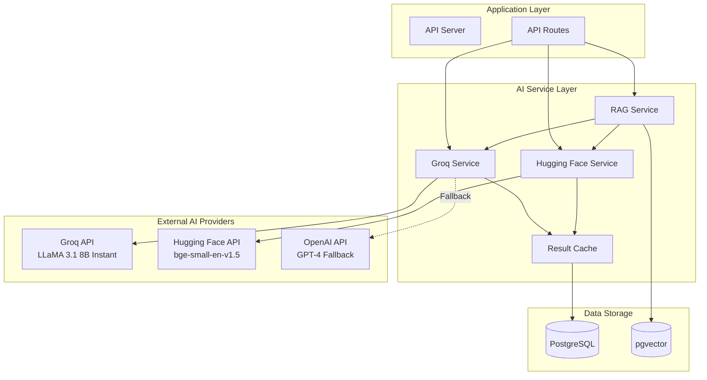
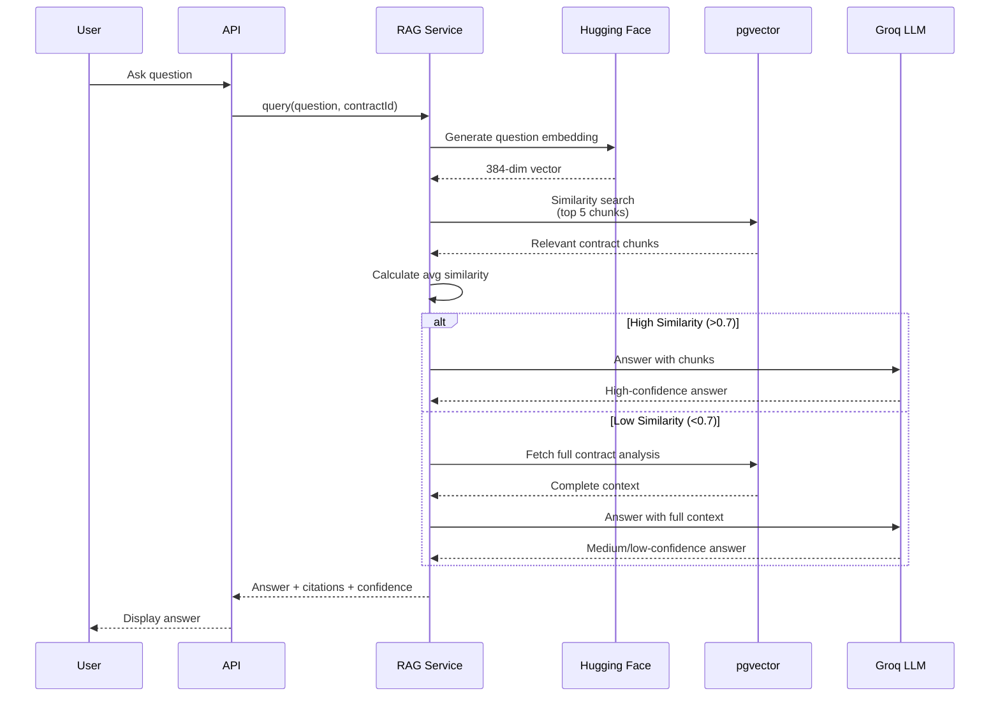

# AI Integration Architecture

**Version:** 1.0.0  
**Date:** October 23, 2025  
**Classification:** Technical - AI Services

---

## Table of Contents
1. [AI Services Overview](#1-ai-services-overview)
2. [Groq LLM Integration](#2-groq-llm-integration)
3. [Hugging Face Embeddings](#3-hugging-face-embeddings)
4. [RAG Architecture](#4-rag-architecture)
5. [Performance & Optimization](#5-performance--optimization)

---

## 1. AI Services Overview

### 1.1 AI Stack Architecture



### 1.2 AI Service Matrix

| Service | Provider | Model | Purpose | Cost |
|---------|----------|-------|---------|------|
| **LLM Inference** | Groq | LLaMA 3.1 8B Instant | Analysis, Q&A, Validation | Free (30 req/min) |
| **Embeddings** | Hugging Face | bge-small-en-v1.5 | Vector generation | Free (unlimited) |
| **Fallback LLM** | OpenAI | GPT-4 | Complex reasoning | $0.03/1K tokens |
| **Vector Search** | Self-hosted | pgvector | Similarity search | Included in PostgreSQL |

---

## 2. Groq LLM Integration

### 2.1 Service Overview

**Model:** LLaMA 3.1 8B Instant  
**API Endpoint:** `https://api.groq.com/openai/v1/chat/completions`  
**Max Context:** 32,768 tokens  
**Speed:** 500+ tokens/second  
**Rate Limit:** 30 requests/minute (free tier)

### 2.2 Use Cases

#### Use Case 1: Contract Analysis
```typescript
interface ContractAnalysisRequest {
  contractText: string;
  extractKeyTerms: boolean;
  identifyRisks: boolean;
  generateInsights: boolean;
}

interface ContractAnalysisResponse {
  summary: string;
  keyTerms: {
    parties: string[];
    effectiveDate: string;
    expirationDate: string;
    territory: string[];
    baseRate: number;
    paymentTerms: string;
  };
  risks: Risk[];
  insights: Insight[];
  confidenceScore: number;
}
```

**Prompt Template:**
```typescript
const ANALYSIS_PROMPT = `You are a legal contract analyst AI. Analyze the following contract and extract structured information.

CONTRACT TEXT:
${contractText}

INSTRUCTIONS:
1. Provide a 3-5 sentence summary
2. Extract key terms (parties, dates, rates, territories)
3. Identify risks and compliance issues
4. Generate strategic insights
5. Provide confidence score (0.0-1.0)

OUTPUT FORMAT (JSON):
{
  "summary": "...",
  "keyTerms": {...},
  "risks": [{type, severity, description, recommendation}],
  "insights": [{category, finding, impact}],
  "confidenceScore": 0.95
}`;
```

**Implementation:**
```typescript
class GroqService {
  async analyzeContract(text: string): Promise<ContractAnalysisResponse> {
    const response = await fetch('https://api.groq.com/openai/v1/chat/completions', {
      method: 'POST',
      headers: {
        'Authorization': `Bearer ${process.env.GROQ_API_KEY}`,
        'Content-Type': 'application/json'
      },
      body: JSON.stringify({
        model: 'llama-3.1-8b-instant',
        messages: [
          {role: 'system', content: 'You are a legal contract analyst AI.'},
          {role: 'user', content: ANALYSIS_PROMPT.replace('${contractText}', text)}
        ],
        temperature: 0.2,  // Low temperature for consistency
        max_tokens: 2000
      })
    });
    
    const data = await response.json();
    const content = data.choices[0].message.content;
    
    // Extract and repair JSON from response
    return extractAndRepairJSON(content);
  }
}
```

#### Use Case 2: Royalty Rule Extraction
```typescript
interface RuleExtractionResponse {
  rules: {
    ruleName: string;
    formulaNode: FormulaNode;
    sourceSection: string;
    sourceText: string;
  }[];
}
```

**Prompt Template:**
```typescript
const RULE_EXTRACTION_PROMPT = `Extract royalty calculation rules from this contract.

CONTRACT TEXT:
${contractText}

Look for:
- Base royalty rates (e.g., "5% of net sales")
- Volume tiers (e.g., "0-1000 units: 5%, 1001+: 7%")
- Seasonal adjustments (e.g., "Q4 sales: 1.2x multiplier")
- Minimum guarantees (e.g., "$100,000 annual minimum")
- Payment caps (e.g., "maximum $500,000 per quarter")

OUTPUT FORMAT (JSON):
{
  "rules": [
    {
      "ruleName": "Volume Tier Rates",
      "formulaNode": {
        "type": "volumeTier",
        "tiers": [
          {"min": 0, "max": 1000, "rate": 0.05},
          {"min": 1001, "max": null, "rate": 0.07}
        ]
      },
      "sourceSection": "Section 4.2(a)",
      "sourceText": "Original clause text..."
    }
  ]
}`;
```

#### Use Case 3: Sales Match Validation
```typescript
async validateMatch(
  salesRecord: SalesRecord,
  contractSummaries: string[]
): Promise<MatchValidation> {
  const prompt = `Validate if this sales record matches any of these contracts.

SALES RECORD:
Product: ${salesRecord.productCode} - ${salesRecord.productDescription}
Date: ${salesRecord.saleDate}
Amount: $${salesRecord.amount}
Quantity: ${salesRecord.quantity}

CANDIDATE CONTRACTS:
${contractSummaries.map((s, i) => `${i+1}. ${s}`).join('\n')}

Rate each contract 0.0-1.0 for match confidence.
Return JSON: {"matches": [{"contractIndex": 1, "confidence": 0.95, "reasoning": "..."}]}`;
  
  const response = await this.callGroq(prompt);
  return extractAndRepairJSON(response);
}
```

#### Use Case 4: RAG Q&A
```typescript
async answerQuestion(
  question: string,
  context: string[]
): Promise<RAGAnswer> {
  const prompt = `Answer the question using only the provided contract context.

CONTEXT:
${context.join('\n\n---\n\n')}

QUESTION:
${question}

INSTRUCTIONS:
- Answer based only on the context provided
- Cite specific contract sections
- If unsure, say "I don't have enough information"
- Provide confidence score (0.0-1.0)

OUTPUT FORMAT (JSON):
{
  "answer": "...",
  "citations": ["Contract CNT-2025-001, Section 4.2", ...],
  "confidence": 0.9
}`;
  
  return await this.callGroq(prompt);
}
```

### 2.3 Error Handling & Retries

```typescript
class GroqService {
  async callGroqWithRetry<T>(
    prompt: string,
    maxRetries = 3
  ): Promise<T> {
    for (let attempt = 1; attempt <= maxRetries; attempt++) {
      try {
        const response = await this.callGroq(prompt);
        return extractAndRepairJSON<T>(response);
      } catch (error) {
        if (attempt === maxRetries) throw error;
        
        // Exponential backoff
        const delay = Math.min(1000 * 2 ** attempt, 10000);
        await sleep(delay);
        
        console.log(`Groq API retry ${attempt}/${maxRetries}`);
      }
    }
  }
}
```

### 2.4 JSON Repair Utility

**Problem:** LLMs sometimes return malformed JSON (missing commas, trailing commas, etc.)

**Solution:**
```typescript
function extractAndRepairJSON<T>(content: string): T {
  // 1. Extract JSON from markdown code blocks
  const jsonMatch = content.match(/```json\n([\s\S]*?)\n```/);
  let jsonStr = jsonMatch ? jsonMatch[1] : content;
  
  // 2. Remove common issues
  jsonStr = jsonStr
    .replace(/,\s*}/g, '}')           // Trailing commas in objects
    .replace(/,\s*\]/g, ']')           // Trailing commas in arrays
    .replace(/:\s*,/g, ': null,')      // Missing values
    .replace(/'/g, '"')                // Single quotes to double
    .trim();
  
  // 3. Parse JSON
  try {
    return JSON.parse(jsonStr);
  } catch (error) {
    console.error('JSON parse error:', error);
    console.error('Attempted to parse:', jsonStr);
    throw new Error('Failed to parse AI response as JSON');
  }
}
```

---

## 3. Hugging Face Embeddings

### 3.1 Service Overview

**Model:** BAAI/bge-small-en-v1.5  
**API Endpoint:** `https://api-inference.huggingface.co/models/BAAI/bge-small-en-v1.5`  
**Embedding Dimension:** 384  
**Max Input:** 512 tokens  
**Rate Limit:** Unlimited (free tier)

### 3.2 Embedding Generation

```typescript
class HuggingFaceService {
  async generateEmbedding(text: string): Promise<number[]> {
    // Truncate to 512 tokens if needed
    const truncatedText = this.truncate(text, 512);
    
    const response = await fetch(
      'https://api-inference.huggingface.co/models/BAAI/bge-small-en-v1.5',
      {
        method: 'POST',
        headers: {
          'Authorization': `Bearer ${process.env.HUGGINGFACE_API_KEY}`,
          'Content-Type': 'application/json'
        },
        body: JSON.stringify({
          inputs: truncatedText,
          options: {wait_for_model: true}
        })
      }
    );
    
    const embedding = await response.json();
    
    // Normalize vector (for cosine similarity)
    return this.normalize(embedding);
  }
  
  private normalize(vector: number[]): number[] {
    const magnitude = Math.sqrt(vector.reduce((sum, val) => sum + val * val, 0));
    return vector.map(val => val / magnitude);
  }
}
```

### 3.3 Batch Embedding

```typescript
async generateBatchEmbeddings(texts: string[]): Promise<number[][]> {
  // Process in batches of 10 to avoid timeouts
  const batchSize = 10;
  const embeddings: number[][] = [];
  
  for (let i = 0; i < texts.length; i += batchSize) {
    const batch = texts.slice(i, i + batchSize);
    
    const batchEmbeddings = await Promise.all(
      batch.map(text => this.generateEmbedding(text))
    );
    
    embeddings.push(...batchEmbeddings);
    
    // Rate limiting: wait 100ms between batches
    if (i + batchSize < texts.length) {
      await sleep(100);
    }
  }
  
  return embeddings;
}
```

### 3.4 Text Chunking Strategy

**For large contracts:**
```typescript
function chunkText(text: string, maxTokens = 512): string[] {
  const chunks: string[] = [];
  const sentences = text.split(/[.!?]+/);
  
  let currentChunk = '';
  let currentTokens = 0;
  
  for (const sentence of sentences) {
    const sentenceTokens = this.estimateTokens(sentence);
    
    if (currentTokens + sentenceTokens > maxTokens) {
      if (currentChunk) chunks.push(currentChunk.trim());
      currentChunk = sentence;
      currentTokens = sentenceTokens;
    } else {
      currentChunk += ' ' + sentence;
      currentTokens += sentenceTokens;
    }
  }
  
  if (currentChunk) chunks.push(currentChunk.trim());
  
  return chunks;
}
```

---

## 4. RAG Architecture

### 4.1 RAG Pipeline Overview



### 4.2 RAG Service Implementation

```typescript
class RAGService {
  async query(
    question: string,
    contractId?: string
  ): Promise<RAGResponse> {
    // 1. Generate question embedding
    const questionEmbedding = await this.hfService.generateEmbedding(question);
    
    // 2. Semantic search for relevant chunks
    const chunks = await this.storage.semanticSearch({
      embedding: questionEmbedding,
      contractId,
      limit: 5
    });
    
    // 3. Calculate average similarity
    const avgSimilarity = chunks.reduce((sum, c) => sum + c.similarity, 0) / chunks.length;
    
    // 4. Decide retrieval strategy
    let context: string[];
    let confidence: 'high' | 'medium' | 'low';
    
    if (avgSimilarity > 0.7) {
      // High similarity: use retrieved chunks
      context = chunks.map(c => c.sourceText);
      confidence = 'high';
    } else {
      // Low similarity: use full contract analysis
      const analysis = await this.storage.getContractAnalysis(contractId);
      context = [
        analysis.summary,
        JSON.stringify(analysis.keyTerms, null, 2),
        ...analysis.insights.map(i => i.finding)
      ];
      confidence = avgSimilarity > 0.5 ? 'medium' : 'low';
    }
    
    // 5. Generate answer with LLM
    const answer = await this.groqService.answerQuestion(question, context);
    
    // 6. Return with metadata
    return {
      answer: answer.answer,
      citations: this.extractCitations(chunks),
      confidence,
      retrievalMethod: avgSimilarity > 0.7 ? 'rag' : 'full_context',
      sourcesUsed: chunks.length
    };
  }
}
```

### 4.3 RAG Quality Metrics

**Evaluation Criteria:**
1. **Answer Relevance:** Does it answer the question?
2. **Factual Accuracy:** Is it based on contract text?
3. **Citation Quality:** Are sources specific and accurate?
4. **Confidence Calibration:** Is confidence score reliable?

**Logging for Analysis:**
```typescript
await this.storage.saveRAGQuery({
  question,
  answer: ragResponse.answer,
  confidence: ragResponse.confidence,
  retrievalMethod: ragResponse.retrievalMethod,
  sourcesUsed: ragResponse.sourcesUsed,
  userFeedback: null  // To be filled by user rating
});
```

---

## 5. Performance & Optimization

### 5.1 Latency Optimization

| Operation | Baseline | Optimized | Strategy |
|-----------|----------|-----------|----------|
| **Contract Analysis** | 30s | 15s | Parallel processing |
| **Embedding Generation** | 5s | 1s | Batch API calls |
| **Vector Search** | 200ms | 20ms | HNSW index |
| **RAG Query** | 8s | 3s | Cache common queries |

### 5.2 Caching Strategy

```typescript
class AICache {
  private cache = new Map<string, {value: any, timestamp: number}>();
  private ttl = 3600000; // 1 hour
  
  async getOrCompute<T>(
    key: string,
    computeFn: () => Promise<T>
  ): Promise<T> {
    const cached = this.cache.get(key);
    
    if (cached && Date.now() - cached.timestamp < this.ttl) {
      return cached.value;
    }
    
    const value = await computeFn();
    this.cache.set(key, {value, timestamp: Date.now()});
    
    return value;
  }
}

// Usage
const embedding = await aiCache.getOrCompute(
  `embedding:${contractId}:summary`,
  () => hfService.generateEmbedding(summaryText)
);
```

### 5.3 Cost Optimization

**Free Tier Usage (Current):**
- Groq: 30 req/min = ~43,000 req/month
- Hugging Face: Unlimited requests
- **Monthly Cost:** $0

**Paid Tier Projection (1,000 users):**
- Groq: Upgrade to paid ($0.27/1M tokens)
- Estimated monthly tokens: 50M
- **Monthly Cost:** ~$135

**Cost Savings:**
1. Cache embeddings (reduce HF calls by 80%)
2. Batch contract analysis (reduce Groq calls by 50%)
3. Use cheaper models for simple tasks

---

## Appendix: AI Service Configuration

### Environment Variables
```bash
# Groq API
GROQ_API_KEY=gsk_...

# Hugging Face
HUGGINGFACE_API_KEY=hf_...

# OpenAI (fallback)
OPENAI_API_KEY=sk-...  # Optional
```

### Rate Limit Monitoring
```typescript
class RateLimiter {
  private requests: number[] = [];
  
  async checkLimit(maxRequests: number, windowMs: number): Promise<void> {
    const now = Date.now();
    this.requests = this.requests.filter(t => now - t < windowMs);
    
    if (this.requests.length >= maxRequests) {
      const oldestRequest = Math.min(...this.requests);
      const waitTime = windowMs - (now - oldestRequest);
      await sleep(waitTime);
    }
    
    this.requests.push(now);
  }
}
```

---

**Document Maintained By:** AI/ML Team  
**Last Updated:** October 23, 2025
