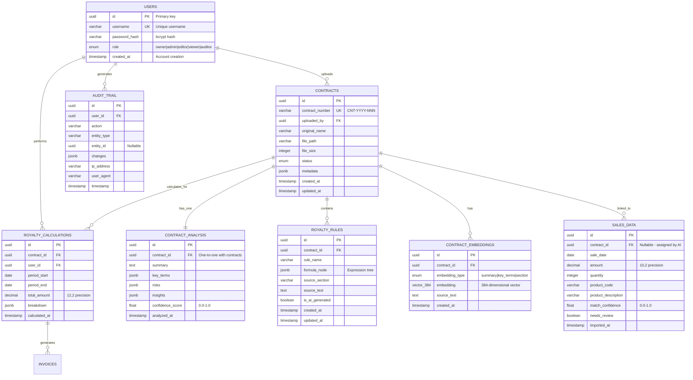

# Database Schema Documentation

**Version:** 1.0.0  
**Date:** October 23, 2025  
**Database:** PostgreSQL 15+ with pgvector extension

---

## Table of Contents
1. [Schema Overview](#1-schema-overview)
2. [Core Tables](#2-core-tables)
3. [Indexes & Performance](#3-indexes--performance)
4. [Data Relationships](#4-data-relationships)
5. [Migration Strategy](#5-migration-strategy)

---

## 1. Schema Overview

### 1.1 Entity Relationship Diagram



---

## 2. Core Tables

### 2.1 users

**Purpose:** User authentication and role-based access control

```sql
CREATE TABLE users (
  id UUID PRIMARY KEY DEFAULT gen_random_uuid(),
  username VARCHAR(255) UNIQUE NOT NULL,
  password_hash VARCHAR(255) NOT NULL,  -- bcrypt, 10 rounds
  role VARCHAR(50) NOT NULL CHECK (role IN ('owner', 'admin', 'editor', 'viewer', 'auditor')),
  created_at TIMESTAMP DEFAULT CURRENT_TIMESTAMP
);

CREATE INDEX idx_users_username ON users(username);
CREATE INDEX idx_users_role ON users(role);
```

**Drizzle Schema:**
```typescript
export const users = pgTable('users', {
  id: varchar('id').primaryKey().$defaultFn(() => nanoid()),
  username: varchar('username', { length: 255 }).unique().notNull(),
  passwordHash: varchar('password_hash', { length: 255 }).notNull(),
  role: varchar('role', { enum: ['owner', 'admin', 'editor', 'viewer', 'auditor'] }).notNull(),
  createdAt: timestamp('created_at').defaultNow()
});
```

**Sample Data:**
```json
{
  "id": "user_01HQXYZ123",
  "username": "john.doe@acme.com",
  "passwordHash": "$2b$10$abc123...",
  "role": "admin",
  "createdAt": "2025-10-23T10:00:00Z"
}
```

---

### 2.2 contracts

**Purpose:** Central registry of all uploaded contracts

```sql
CREATE TABLE contracts (
  id UUID PRIMARY KEY DEFAULT gen_random_uuid(),
  contract_number VARCHAR(50) UNIQUE NOT NULL,  -- Format: CNT-YYYY-NNN
  uploaded_by UUID REFERENCES users(id) ON DELETE SET NULL,
  original_name VARCHAR(500) NOT NULL,
  file_path VARCHAR(1000) NOT NULL,
  file_size INTEGER,  -- Bytes
  status VARCHAR(50) CHECK (status IN ('uploaded', 'processing', 'analyzed', 'failed')),
  metadata JSONB,  -- Flexible additional data
  created_at TIMESTAMP DEFAULT CURRENT_TIMESTAMP,
  updated_at TIMESTAMP DEFAULT CURRENT_TIMESTAMP
);

CREATE INDEX idx_contracts_uploaded_by ON contracts(uploaded_by);
CREATE INDEX idx_contracts_status ON contracts(status);
CREATE INDEX idx_contracts_created_at ON contracts(created_at DESC);
```

**Drizzle Schema:**
```typescript
export const contracts = pgTable('contracts', {
  id: varchar('id').primaryKey().$defaultFn(() => nanoid()),
  contractNumber: varchar('contract_number', { length: 50 }).unique().notNull(),
  uploadedBy: varchar('uploaded_by').references(() => users.id, { onDelete: 'set null' }),
  originalName: varchar('original_name', { length: 500 }).notNull(),
  filePath: varchar('file_path', { length: 1000 }).notNull(),
  fileSize: integer('file_size'),
  status: varchar('status', { enum: ['uploaded', 'processing', 'analyzed', 'failed'] }).default('uploaded'),
  metadata: jsonb('metadata'),
  createdAt: timestamp('created_at').defaultNow(),
  updatedAt: timestamp('updated_at').defaultNow()
});
```

**Sample Data:**
```json
{
  "id": "cnt_01HQXYZ456",
  "contractNumber": "CNT-2025-001",
  "uploadedBy": "user_01HQXYZ123",
  "originalName": "Acme_Licensing_Agreement_2025.pdf",
  "filePath": "/uploads/contracts/cnt_01HQXYZ456.pdf",
  "fileSize": 2457600,
  "status": "analyzed",
  "metadata": {
    "tags": ["licensing", "2025"],
    "category": "brand_licensing"
  },
  "createdAt": "2025-10-23T10:05:00Z",
  "updatedAt": "2025-10-23T10:06:15Z"
}
```

---

### 2.3 contract_analysis

**Purpose:** Store AI-generated contract analysis results

```sql
CREATE TABLE contract_analysis (
  id UUID PRIMARY KEY DEFAULT gen_random_uuid(),
  contract_id UUID UNIQUE REFERENCES contracts(id) ON DELETE CASCADE,
  summary TEXT,
  key_terms JSONB,  -- {parties, effectiveDate, expirationDate, territory, baseRate}
  risks JSONB,      -- [{type, severity, description, recommendation}]
  insights JSONB,   -- [{category, finding, impact}]
  confidence_score FLOAT CHECK (confidence_score >= 0 AND confidence_score <= 1),
  analyzed_at TIMESTAMP DEFAULT CURRENT_TIMESTAMP
);

CREATE INDEX idx_analysis_contract_id ON contract_analysis(contract_id);
CREATE INDEX idx_analysis_confidence ON contract_analysis(confidence_score);
```

**key_terms Structure:**
```json
{
  "parties": ["Acme Corp", "Widget Inc"],
  "effectiveDate": "2025-01-01",
  "expirationDate": "2027-12-31",
  "territory": ["United States", "Canada"],
  "baseRate": 0.05,
  "paymentTerms": "Net 30",
  "minimumGuarantee": 100000
}
```

**risks Structure:**
```json
[
  {
    "type": "compliance",
    "severity": "high",
    "description": "Missing GDPR data protection clause",
    "recommendation": "Add data protection addendum before EU operations",
    "section": "Section 12"
  }
]
```

---

### 2.4 royalty_rules

**Purpose:** Store royalty calculation formulas and rules

```sql
CREATE TABLE royalty_rules (
  id UUID PRIMARY KEY DEFAULT gen_random_uuid(),
  contract_id UUID REFERENCES contracts(id) ON DELETE CASCADE,
  rule_name VARCHAR(255) NOT NULL,
  formula_node JSONB NOT NULL,  -- Expression tree for calculations
  source_section VARCHAR(500),  -- "Section 4.2, Page 12"
  source_text TEXT,             -- Original contract clause
  is_ai_generated BOOLEAN DEFAULT true,
  created_at TIMESTAMP DEFAULT CURRENT_TIMESTAMP,
  updated_at TIMESTAMP DEFAULT CURRENT_TIMESTAMP
);

CREATE INDEX idx_rules_contract_id ON royalty_rules(contract_id);
CREATE INDEX idx_rules_ai_generated ON royalty_rules(is_ai_generated);
```

**FormulaNode Example (Volume Tiers):**
```json
{
  "type": "volumeTier",
  "description": "Progressive rate based on volume",
  "tiers": [
    {"min": 0, "max": 1000, "rate": 0.05},
    {"min": 1001, "max": 5000, "rate": 0.07},
    {"min": 5001, "max": null, "rate": 0.10}
  ],
  "variable": "quantity",
  "sourceSection": "Section 4.2(a)"
}
```

**FormulaNode Example (Seasonal Adjustment):**
```json
{
  "type": "seasonal",
  "description": "Holiday season multiplier",
  "seasonalRates": {
    "Q1": 1.0,
    "Q2": 1.0,
    "Q3": 1.1,
    "Q4": 1.2
  },
  "sourceSection": "Section 4.3"
}
```

---

### 2.5 contract_embeddings

**Purpose:** Store vector embeddings for semantic search (pgvector)

```sql
CREATE EXTENSION IF NOT EXISTS vector;

CREATE TABLE contract_embeddings (
  id UUID PRIMARY KEY DEFAULT gen_random_uuid(),
  contract_id UUID REFERENCES contracts(id) ON DELETE CASCADE,
  embedding_type VARCHAR(50) CHECK (embedding_type IN ('summary', 'key_terms', 'section')),
  embedding VECTOR(384),  -- 384-dimensional vector
  source_text TEXT,       -- Original text that was embedded
  created_at TIMESTAMP DEFAULT CURRENT_TIMESTAMP
);

CREATE INDEX idx_embeddings_contract_id ON contract_embeddings(contract_id);
CREATE INDEX idx_embeddings_type ON contract_embeddings(embedding_type);

-- HNSW index for fast similarity search
CREATE INDEX idx_embeddings_vector 
ON contract_embeddings 
USING hnsw (embedding vector_cosine_ops);
```

**Vector Search Query:**
```sql
-- Find top 5 most similar contracts to a question
SELECT 
  ce.contract_id,
  ce.source_text,
  1 - (ce.embedding <=> $1::vector) AS similarity
FROM contract_embeddings ce
WHERE ce.embedding_type = 'summary'
ORDER BY ce.embedding <=> $1::vector
LIMIT 5;
```

**Drizzle Extension:**
```typescript
import { sql } from 'drizzle-orm';

export const contractEmbeddings = pgTable('contract_embeddings', {
  id: varchar('id').primaryKey().$defaultFn(() => nanoid()),
  contractId: varchar('contract_id').references(() => contracts.id, { onDelete: 'cascade' }),
  embeddingType: varchar('embedding_type', { enum: ['summary', 'key_terms', 'section'] }),
  embedding: sql`vector(384)`,
  sourceText: text('source_text'),
  createdAt: timestamp('created_at').defaultNow()
});
```

---

### 2.6 sales_data

**Purpose:** Store imported sales transactions for royalty calculations

```sql
CREATE TABLE sales_data (
  id UUID PRIMARY KEY DEFAULT gen_random_uuid(),
  contract_id UUID REFERENCES contracts(id) ON DELETE SET NULL,  -- Assigned by AI matching
  sale_date DATE NOT NULL,
  amount DECIMAL(10, 2) NOT NULL,
  quantity INTEGER,
  product_code VARCHAR(100),
  product_description TEXT,
  match_confidence FLOAT CHECK (match_confidence >= 0 AND match_confidence <= 1),
  needs_review BOOLEAN DEFAULT false,
  imported_at TIMESTAMP DEFAULT CURRENT_TIMESTAMP
);

CREATE INDEX idx_sales_contract_id ON sales_data(contract_id);
CREATE INDEX idx_sales_date ON sales_data(sale_date);
CREATE INDEX idx_sales_needs_review ON sales_data(needs_review) WHERE needs_review = true;
```

**Sample Data:**
```json
{
  "id": "sale_01HQXYZ789",
  "contractId": "cnt_01HQXYZ456",
  "saleDate": "2025-09-15",
  "amount": 15000.50,
  "quantity": 300,
  "productCode": "WDG-1001",
  "productDescription": "Widget Pro Series",
  "matchConfidence": 0.95,
  "needsReview": false,
  "importedAt": "2025-10-23T11:00:00Z"
}
```

---

### 2.7 royalty_calculations

**Purpose:** Store royalty calculation results and history

```sql
CREATE TABLE royalty_calculations (
  id UUID PRIMARY KEY DEFAULT gen_random_uuid(),
  contract_id UUID REFERENCES contracts(id) ON DELETE CASCADE,
  user_id UUID REFERENCES users(id) ON DELETE SET NULL,
  period_start DATE NOT NULL,
  period_end DATE NOT NULL,
  total_amount DECIMAL(12, 2) NOT NULL,
  breakdown JSONB NOT NULL,  -- Detailed calculation breakdown
  calculated_at TIMESTAMP DEFAULT CURRENT_TIMESTAMP
);

CREATE INDEX idx_calculations_contract_id ON royalty_calculations(contract_id);
CREATE INDEX idx_calculations_user_id ON royalty_calculations(user_id);
CREATE INDEX idx_calculations_period ON royalty_calculations(period_start, period_end);
CREATE INDEX idx_calculations_calculated_at ON royalty_calculations(calculated_at DESC);
```

**breakdown Structure:**
```json
{
  "totalSalesRecords": 1250,
  "ruleResults": [
    {
      "ruleId": "rule_01HQXYZ",
      "ruleName": "Volume Tier Rates",
      "amount": 87500.00,
      "tierBreakdown": [
        {"tier": "0-1000 units (5%)", "salesCount": 800, "amount": 40000.00},
        {"tier": "1001-5000 units (7%)", "salesCount": 450, "amount": 47500.00}
      ]
    }
  ],
  "seasonalAdjustments": {
    "Q3": {"multiplier": 1.1, "additionalAmount": 8750.00}
  },
  "minimumGuarantee": null,
  "cappedAmount": null
}
```

---

### 2.8 audit_trail

**Purpose:** SOX-compliant activity logging for all user actions

```sql
CREATE TABLE audit_trail (
  id UUID PRIMARY KEY DEFAULT gen_random_uuid(),
  user_id UUID REFERENCES users(id) ON DELETE SET NULL,
  action VARCHAR(100) NOT NULL,  -- 'create', 'update', 'delete', 'login', 'calculate'
  entity_type VARCHAR(100),       -- 'contract', 'sales', 'rule', 'calculation'
  entity_id UUID,                 -- ID of affected entity
  changes JSONB,                  -- {before: {...}, after: {...}}
  ip_address VARCHAR(45),
  user_agent TEXT,
  timestamp TIMESTAMP DEFAULT CURRENT_TIMESTAMP
);

CREATE INDEX idx_audit_user_id ON audit_trail(user_id);
CREATE INDEX idx_audit_action ON audit_trail(action);
CREATE INDEX idx_audit_entity ON audit_trail(entity_type, entity_id);
CREATE INDEX idx_audit_timestamp ON audit_trail(timestamp DESC);
```

**Sample Data:**
```json
{
  "id": "audit_01HQXYZ",
  "userId": "user_01HQXYZ123",
  "action": "contract_upload",
  "entityType": "contract",
  "entityId": "cnt_01HQXYZ456",
  "changes": {
    "before": null,
    "after": {
      "contractNumber": "CNT-2025-001",
      "fileName": "Acme_Licensing_Agreement_2025.pdf"
    }
  },
  "ipAddress": "192.168.1.100",
  "userAgent": "Mozilla/5.0...",
  "timestamp": "2025-10-23T10:05:00Z"
}
```

---

## 3. Indexes & Performance

### 3.1 Index Strategy

**B-Tree Indexes (Default):**
- Primary keys: `id` columns (automatic)
- Foreign keys: All `_id` reference columns
- Unique constraints: `contract_number`, `username`
- Frequently queried: `status`, `sale_date`, `timestamp`

**HNSW Index (Vector Search):**
```sql
CREATE INDEX idx_embeddings_vector 
ON contract_embeddings 
USING hnsw (embedding vector_cosine_ops);
```

**Partial Indexes (Filtered):**
```sql
-- Only index sales that need review (reduces index size)
CREATE INDEX idx_sales_needs_review 
ON sales_data(needs_review) 
WHERE needs_review = true;
```

### 3.2 Query Performance

**Typical Query Times:**
- Contract list (paginated): <50ms
- Contract details with analysis: <100ms
- Vector similarity search: <50ms
- Royalty calculation (10K sales): <2 seconds
- Audit log query (filtered): <100ms

### 3.3 Database Size Estimates

| Entity | Rows (Year 1) | Size per Row | Total Size |
|--------|---------------|--------------|------------|
| Users | 50 | 500 B | 25 KB |
| Contracts | 1,000 | 2 KB | 2 MB |
| Contract Analysis | 1,000 | 5 KB | 5 MB |
| Royalty Rules | 5,000 | 1 KB | 5 MB |
| Embeddings | 3,000 | 2 KB | 6 MB |
| Sales Data | 500,000 | 500 B | 250 MB |
| Calculations | 10,000 | 3 KB | 30 MB |
| Audit Trail | 100,000 | 1 KB | 100 MB |
| **Total** | | | **~400 MB** |

---

## 4. Data Relationships

### 4.1 One-to-One Relationships
- `contracts` ↔ `contract_analysis` (each contract has exactly one analysis)

### 4.2 One-to-Many Relationships
- `users` → `contracts` (user uploads many contracts)
- `contracts` → `royalty_rules` (contract contains many rules)
- `contracts` → `contract_embeddings` (contract has multiple embeddings)
- `contracts` → `sales_data` (contract linked to many sales)
- `contracts` → `royalty_calculations` (contract has multiple calculations)

### 4.3 Referential Integrity

**CASCADE Deletes:**
- Delete contract → delete analysis, rules, embeddings, calculations
- Maintains data consistency

**SET NULL:**
- Delete user → set `uploaded_by` to NULL (keep contract data)
- Delete contract → set `contract_id` in sales to NULL (keep sales data)

---

## 5. Migration Strategy

### 5.1 Schema Changes

**Current Approach:**
```bash
# Push schema changes directly to database (no migrations)
npm run db:push

# If data-loss warning:
npm run db:push --force
```

**Drizzle generates SQL:**
```sql
-- Example: Add new column
ALTER TABLE contracts ADD COLUMN tags VARCHAR(255)[];

-- Example: Add new index
CREATE INDEX idx_contracts_tags ON contracts USING GIN(tags);
```

### 5.2 Data Migrations

**For complex transformations:**
```typescript
// scripts/migrate-data.ts
import { db } from './db';

async function migrateFormulaFormat() {
  const rules = await db.select().from(royaltyRules);
  
  for (const rule of rules) {
    // Transform old format to new format
    const newFormulaNode = transformFormula(rule.formulaNode);
    await db.update(royaltyRules)
      .set({ formulaNode: newFormulaNode })
      .where(eq(royaltyRules.id, rule.id));
  }
}
```

### 5.3 Backup & Recovery

**Neon Database:**
- Automatic backups daily
- Point-in-time recovery (PITR)
- Backup retention: 30 days

**Manual Backup:**
```bash
# Backup entire database
pg_dump -h neon-host -U user -d licenseiq > backup.sql

# Restore from backup
psql -h neon-host -U user -d licenseiq < backup.sql
```

---

## Appendix: SQL Queries

### Common Queries

**Get contract with full details:**
```sql
SELECT 
  c.*,
  ca.summary,
  ca.key_terms,
  array_agg(DISTINCT rr.rule_name) as rule_names,
  COUNT(DISTINCT sd.id) as sales_count
FROM contracts c
LEFT JOIN contract_analysis ca ON ca.contract_id = c.id
LEFT JOIN royalty_rules rr ON rr.contract_id = c.id
LEFT JOIN sales_data sd ON sd.contract_id = c.id
WHERE c.id = $1
GROUP BY c.id, ca.id;
```

**Find contracts expiring soon:**
```sql
SELECT c.*, ca.key_terms->>'expirationDate' as expiration
FROM contracts c
JOIN contract_analysis ca ON ca.contract_id = c.id
WHERE (ca.key_terms->>'expirationDate')::date < CURRENT_DATE + INTERVAL '30 days';
```

**Sales matching performance:**
```sql
SELECT 
  CASE 
    WHEN match_confidence >= 0.8 THEN 'High'
    WHEN match_confidence >= 0.5 THEN 'Medium'
    ELSE 'Low'
  END as confidence_level,
  COUNT(*) as count,
  ROUND(AVG(match_confidence), 2) as avg_confidence
FROM sales_data
WHERE contract_id IS NOT NULL
GROUP BY confidence_level;
```

---

**Document Maintained By:** Database Team  
**Schema Version:** 1.0.0  
**Last Updated:** October 23, 2025
