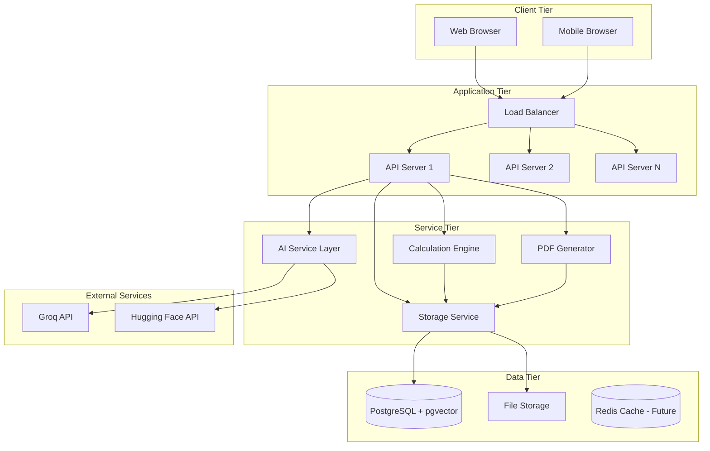
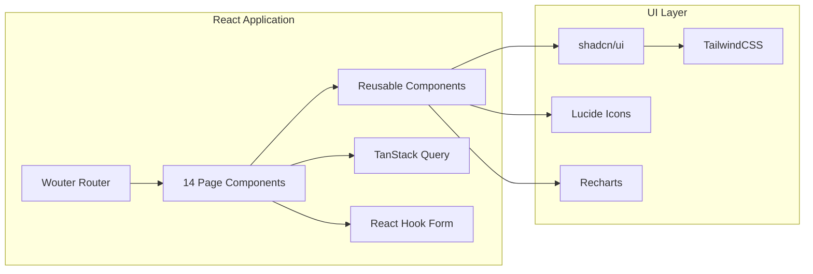
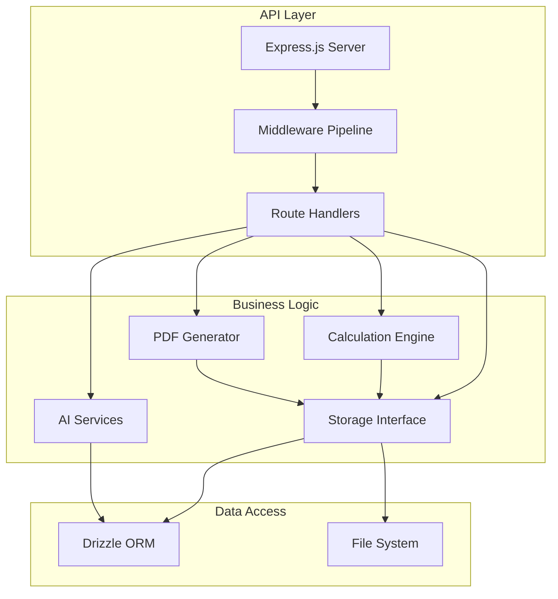
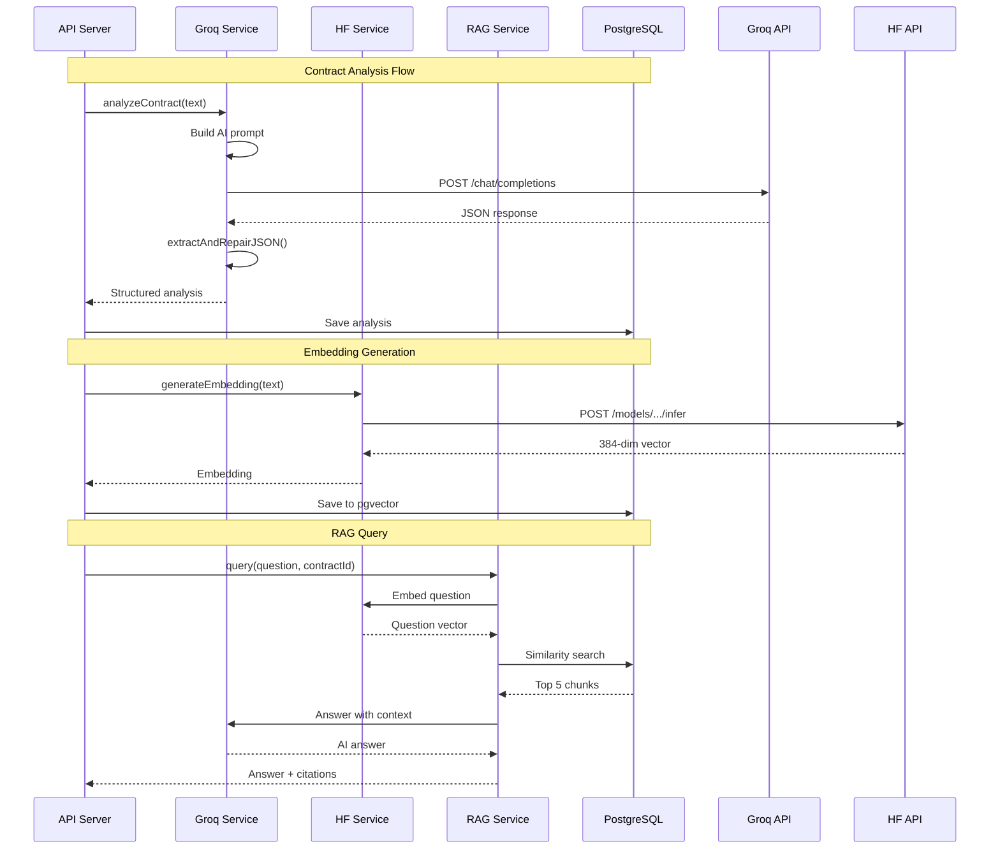
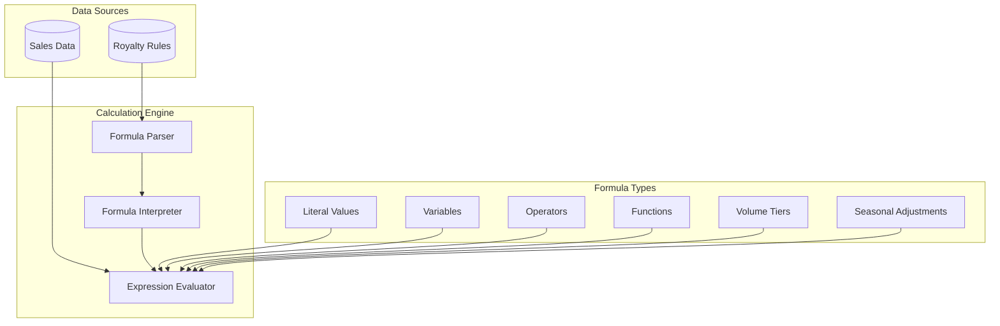
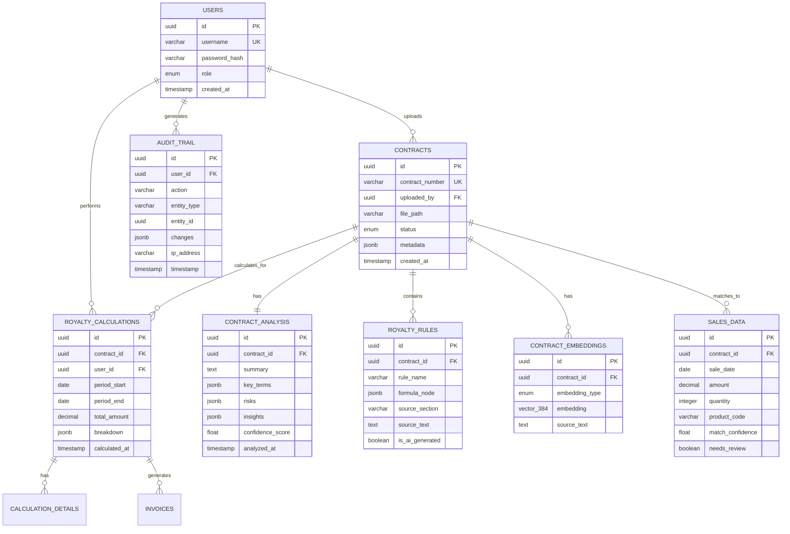
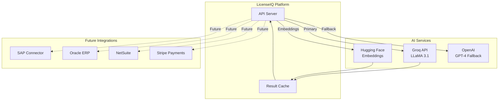
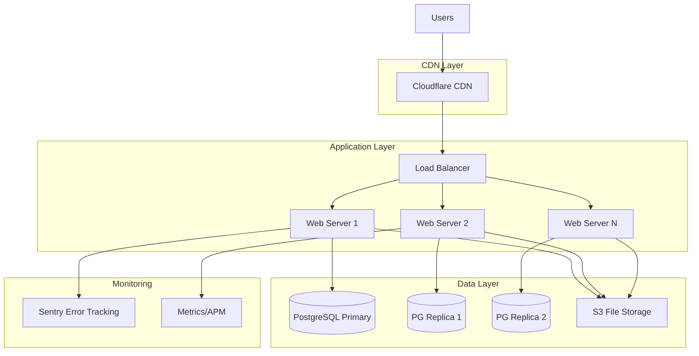

# System Architecture Document

**Version:** 1.0.0  
**Date:** October 23, 2025  
**Classification:** Technical Architecture

---

## Table of Contents
1. [Architecture Overview](#1-architecture-overview)
2. [System Components](#2-system-components)
3. [Data Architecture](#3-data-architecture)
4. [Integration Architecture](#4-integration-architecture)
5. [Deployment Architecture](#5-deployment-architecture)

---

## 1. Architecture Overview

### 1.1 High-Level Architecture



### 1.2 Architecture Principles

**1. Separation of Concerns**
- Frontend handles presentation only
- Backend handles business logic
- Database handles data persistence
- External APIs handle AI processing

**2. Type Safety**
- TypeScript across entire stack
- Drizzle ORM for type-safe database queries
- Zod for runtime validation
- No runtime type errors

**3. Stateless API Servers**
- Session state in PostgreSQL
- No in-memory session storage
- Horizontal scaling ready
- Load balancer compatible

**4. API-First Design**
- RESTful endpoints
- JSON request/response
- Versioned APIs (future: `/api/v1/...`)
- Client-agnostic (supports web, mobile, third-party)

**5. Security by Default**
- HTTPS only
- Session-based authentication
- RBAC on all endpoints
- Input validation everywhere

---

## 2. System Components

### 2.1 Frontend Architecture



**Key Design Patterns:**

**1. Container/Presenter Pattern**
```typescript
// Container (smart component)
function ContractListContainer() {
  const { data, isLoading } = useQuery({ queryKey: ['/api/contracts'] });
  return <ContractListPresenter contracts={data} loading={isLoading} />;
}

// Presenter (dumb component)
function ContractListPresenter({ contracts, loading }) {
  if (loading) return <Skeleton />;
  return <Table data={contracts} />;
}
```

**2. Custom Hooks for Business Logic**
```typescript
function useContractUpload() {
  const mutation = useMutation({
    mutationFn: (file: File) => uploadContract(file),
    onSuccess: () => queryClient.invalidateQueries(['/api/contracts'])
  });
  return { upload: mutation.mutate, isUploading: mutation.isPending };
}
```

**3. Optimistic Updates**
```typescript
useMutation({
  mutationFn: updateContract,
  onMutate: async (newData) => {
    await queryClient.cancelQueries(['/api/contracts', id]);
    const previous = queryClient.getQueryData(['/api/contracts', id]);
    queryClient.setQueryData(['/api/contracts', id], newData);
    return { previous };
  },
  onError: (err, variables, context) => {
    queryClient.setQueryData(['/api/contracts', id], context.previous);
  }
});
```

### 2.2 Backend Architecture



**Middleware Pipeline:**
```typescript
// 1. CORS
app.use(cors({ origin: allowedOrigins, credentials: true }));

// 2. Body Parsing
app.use(express.json({ limit: '50mb' }));

// 3. Session Management
app.use(session({ store: pgSession, secret, cookie: { httpOnly: true, secure: true } }));

// 4. Authentication
app.use(passport.initialize());
app.use(passport.session());

// 5. Request Logging
app.use(requestLogger);

// 6. Routes
app.use('/api', routes);

// 7. Error Handler
app.use(errorHandler);
```

**Service Layer Pattern:**
```typescript
// IStorage interface (abstraction)
interface IStorage {
  createContract(data: InsertContract): Promise<Contract>;
  getContract(id: string): Promise<Contract | null>;
  updateContract(id: string, data: Partial<Contract>): Promise<Contract>;
  deleteContract(id: string): Promise<void>;
}

// DrizzleStorage implementation
class DrizzleStorage implements IStorage {
  async createContract(data: InsertContract): Promise<Contract> {
    const [contract] = await db.insert(contracts).values(data).returning();
    return contract;
  }
  // ... other methods
}
```

### 2.3 AI Service Architecture



**AI Service Error Handling:**
```typescript
class GroqService {
  async analyzeContract(text: string, retries = 3): Promise<Analysis> {
    for (let i = 0; i < retries; i++) {
      try {
        const response = await fetch(GROQ_API, {
          method: 'POST',
          headers: { 'Authorization': `Bearer ${GROQ_API_KEY}` },
          body: JSON.stringify({ model: 'llama-3.1-8b-instant', messages: [...] })
        });
        
        if (!response.ok) throw new Error(`Groq API error: ${response.status}`);
        
        const data = await response.json();
        const content = data.choices[0].message.content;
        return extractAndRepairJSON(content);
        
      } catch (error) {
        if (i === retries - 1) throw error;
        await sleep(2 ** i * 1000); // Exponential backoff
      }
    }
  }
}
```

### 2.4 Calculation Engine Architecture



**FormulaNode Evaluation:**
```typescript
function evaluateFormula(node: FormulaNode, context: SalesData[]): number {
  switch (node.type) {
    case 'literal':
      return node.value;
      
    case 'variable':
      return context[node.name]; // e.g., context.totalAmount
      
    case 'operator':
      const left = evaluateFormula(node.left, context);
      const right = evaluateFormula(node.right, context);
      return applyOperator(node.operator, left, right);
      
    case 'volumeTier':
      const quantity = context[node.variable];
      const tier = node.tiers.find(t => quantity >= t.min && quantity <= t.max);
      return quantity * tier.rate;
      
    case 'seasonal':
      const month = new Date(context.saleDate).getMonth();
      const season = getSeasonForMonth(month);
      const multiplier = node.seasonalRates[season];
      return baseAmount * multiplier;
      
    case 'function':
      return evaluateFunction(node.function, node.args, context);
  }
}
```

---

## 3. Data Architecture

### 3.1 Database Schema (ER Diagram)



### 3.2 Vector Search Architecture

**pgvector Integration:**
```sql
-- Enable extension
CREATE EXTENSION IF NOT EXISTS vector;

-- Create table with vector column
CREATE TABLE contract_embeddings (
  id UUID PRIMARY KEY,
  contract_id UUID REFERENCES contracts(id),
  embedding_type VARCHAR(50),
  embedding VECTOR(384),  -- 384 dimensions
  source_text TEXT
);

-- Create HNSW index for fast similarity search
CREATE INDEX idx_embeddings_vector 
ON contract_embeddings 
USING hnsw (embedding vector_cosine_ops);
```

**Similarity Search Query:**
```typescript
// Find similar contracts using cosine similarity
const results = await db.execute(sql`
  SELECT 
    ce.contract_id,
    ce.source_text,
    1 - (ce.embedding <=> ${questionEmbedding}::vector) AS similarity
  FROM contract_embeddings ce
  WHERE ce.embedding_type = 'summary'
  ORDER BY ce.embedding <=> ${questionEmbedding}::vector
  LIMIT 5
`);
```

### 3.3 Data Flow Patterns

**Write Pattern (CQRS-lite):**
```typescript
// Command: Create contract
async function uploadContract(file: File, userId: string) {
  // 1. Validate
  if (file.size > MAX_SIZE) throw new Error('File too large');
  
  // 2. Save file
  const filePath = await saveFile(file);
  
  // 3. Insert database record
  const contract = await storage.createContract({
    uploadedBy: userId,
    filePath,
    status: 'uploaded'
  });
  
  // 4. Trigger async analysis
  analyzeContractAsync(contract.id);
  
  // 5. Audit log
  await storage.createAuditLog({
    userId,
    action: 'contract_upload',
    entityId: contract.id
  });
  
  return contract;
}
```

**Read Pattern (Query):**
```typescript
// Query: Get contract with analysis
async function getContractDetails(contractId: string) {
  // Join contract + analysis + rules in single query
  const result = await db.query.contracts.findFirst({
    where: eq(contracts.id, contractId),
    with: {
      analysis: true,
      rules: true,
      embeddings: true
    }
  });
  
  return result;
}
```

---

## 4. Integration Architecture

### 4.1 External Service Integration



**Integration Patterns:**

**1. Circuit Breaker Pattern**
```typescript
class CircuitBreaker {
  private failures = 0;
  private state: 'closed' | 'open' | 'half-open' = 'closed';
  
  async execute<T>(fn: () => Promise<T>): Promise<T> {
    if (this.state === 'open') {
      throw new Error('Circuit breaker is open');
    }
    
    try {
      const result = await fn();
      this.onSuccess();
      return result;
    } catch (error) {
      this.onFailure();
      throw error;
    }
  }
  
  private onFailure() {
    this.failures++;
    if (this.failures >= 5) {
      this.state = 'open';
      setTimeout(() => this.state = 'half-open', 60000); // 1 min
    }
  }
}
```

**2. Retry with Exponential Backoff**
```typescript
async function retryWithBackoff<T>(
  fn: () => Promise<T>,
  maxRetries = 3
): Promise<T> {
  for (let i = 0; i < maxRetries; i++) {
    try {
      return await fn();
    } catch (error) {
      if (i === maxRetries - 1) throw error;
      const delay = Math.min(1000 * 2 ** i, 10000);
      await sleep(delay);
    }
  }
}
```

### 4.2 API Versioning Strategy

**Current (v1.0):**
- No version prefix: `/api/contracts`
- All endpoints under `/api`

**Future (v2.0+):**
- Versioned prefix: `/api/v2/contracts`
- Maintain `/api/v1/...` for backward compatibility
- Deprecation warnings for old versions

---

## 5. Deployment Architecture

### 5.1 Development Environment

```
Developer Machine
├── Code Editor (VSCode)
├── Git (version control)
└── Replit Environment
    ├── Node.js 20 runtime
    ├── PostgreSQL (Neon dev branch)
    ├── File storage (/uploads)
    └── Environment variables (.env)
```

### 5.2 Production Architecture



### 5.3 Scaling Strategy

**Vertical Scaling (Current):**
- Single server instance
- Scale CPU/RAM as needed
- Good for 0-100 users

**Horizontal Scaling (Future):**
- Multiple API server instances
- Load balancer distribution
- Session in PostgreSQL (stateless servers)
- Good for 100-10,000 users

**Database Scaling:**
- Read replicas for query distribution
- Connection pooling (pgBouncer)
- Caching layer (Redis) for hot data

---

## Appendix: Architecture Decision Records (ADRs)

### ADR-001: Session-Based Auth vs JWT

**Decision:** Use session-based authentication  
**Rationale:**
- Better security (server-side revocation)
- Simpler implementation
- No token expiry complexity
- PostgreSQL session store (already using PG)

**Alternatives Considered:**
- JWT: Rejected due to no server-side revocation
- OAuth: Overkill for initial MVP

### ADR-002: Drizzle vs Prisma ORM

**Decision:** Use Drizzle ORM  
**Rationale:**
- Better TypeScript inference
- Zero runtime overhead
- SQL-like syntax (easier for developers)
- Better pgvector support

**Alternatives Considered:**
- Prisma: Good, but heavier runtime
- TypeORM: Less type-safe

### ADR-003: Groq vs OpenAI for Primary LLM

**Decision:** Use Groq as primary, OpenAI as fallback  
**Rationale:**
- Groq: Free tier, 500+ tok/s, sufficient for analysis
- OpenAI: Better reasoning, use for complex cases
- Cost optimization (free first)

**Alternatives Considered:**
- OpenAI only: Too expensive
- Anthropic Claude: Good, but Groq faster

---

**Document Maintained By:** Architecture Team  
**Review Cycle:** Quarterly  
**Last Reviewed:** October 23, 2025
